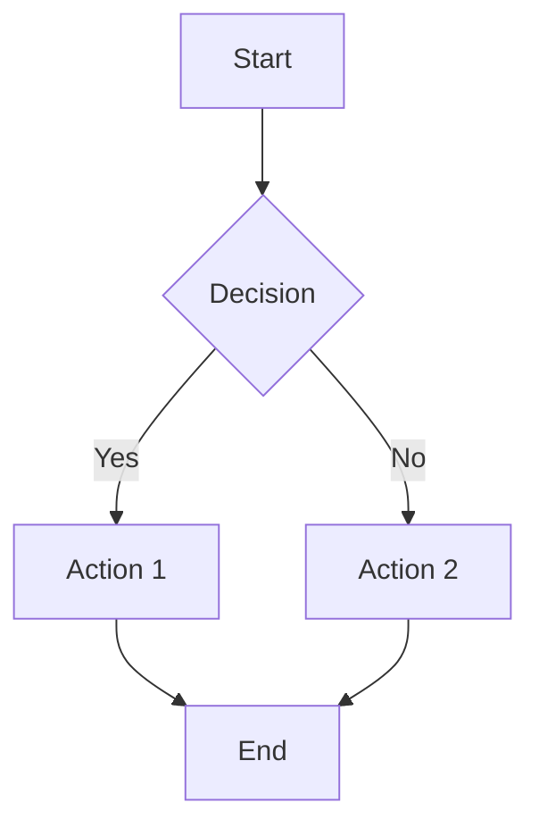

# Markdown2 Sample

[TOC]

## Writing

Markdown2 keeps the page quiet while still showing Markdown structure in the editor.

- [x] Native macOS window
- [x] Outline
- [x] Live reading view
- [x] Math & chemistry formulas
- [x] Diagrams (Mermaid / Flowchart / Sequence)
- [ ] Export formats

## Text Formatting

**Bold text**, *italic text*, and ***bold italic***.

~~Strikethrough text~~ is also supported.

Inline `code` with HTML-safe characters like `<tag>`.

Backslash escapes: \*not italic\*, \#not a heading.

HTML entities: &copy; &rarr; &hearts; &#x1F600;

Safe inline HTML: <u>underline</u>, <kbd>Cmd+S</kbd>, <mark>highlighted</mark>, H<sub>2</sub>O, x<sup>2</sup>.

## Links & Images

[Markdown2](https://example.com) — a link with title.

<https://example.com> — autolink.


## Footnotes

Footnotes let you add citations and asides without cluttering the prose.[^1] You can use numbered labels or named ones[^typora], and the same note can be referenced more than once.[^1]

[^1]: This is the first footnote — referenced twice from the paragraph above.
[^typora]: Named labels work too. See the Typora reference: <https://support.typora.io/Markdown-Reference/#footnotes>.
    Continuation lines are indented and become part of the same footnote.

## Block Elements

> Blockquote with **bold** and *italic*.
>
> > Nested blockquote.
>
> - List inside blockquote

---

## Lists

Unordered:

- Item one
- Item two
  - Nested item
  - Another nested
* Star marker
+ Plus marker

Ordered:

1. First item
2. Second item
3) Parenthesis marker

Task list:

- [x] Parse block elements
- [x] Parse inline elements
- [x] Support math formulas
- [ ] Full CommonMark conformance

## Tables

| Feature | Status | Priority |
| :--- | :---: | ---: |
| Headings | Done | High |
| Tables | Done | Medium |
| Math | Done | High |
| Diagrams | Done | Medium |
| Export | Pending | Low |

## Code Blocks

```swift
struct Markdown2 {
    let name: String
    var version: Double = 1.0

    func render(_ input: String) -> String {
        return Parser.parse(input).render()
    }
}
```

```python
def fibonacci(n: int) -> list[int]:
    a, b = 0, 1
    result = []
    for _ in range(n):
        result.append(a)
        a, b = b, a + b
    return result
```

Indented code block:

    if (x > 0) {
        return x * 2;
    }

## Math Formulas

Inline math: The mass-energy equivalence is $E = mc^2$, and the quadratic formula is $x = \frac{-b \pm \sqrt{b^2 - 4ac}}{2a}$.

Display math:

$$
\int_0^\infty e^{-x^2} \, dx = \frac{\sqrt{\pi}}{2}
$$

$$
\sum_{n=1}^{\infty} \frac{1}{n^2} = \frac{\pi^2}{6}
$$

Maxwell's equations:

$$
\nabla \times \mathbf{E} = -\frac{\partial \mathbf{B}}{\partial t}
$$

## Chemistry Formulas

Inline chemistry: The reaction $\ce{2H2 + O2 -> 2H2O}$ produces water.

Sulfuric acid: $\ce{H2SO4}$

Thermite reaction:

$$
\ce{2Al + Fe2O3 ->[\Delta] Al2O3 + 2Fe}
$$

Equilibrium:

$$
\ce{CO2 + H2O <=> H2CO3}
$$

## Diagrams

### Mermaid



### Flowchart

```flow
st=>start: Start
op=>operation: Process Data
cond=>condition: Valid?
e=>end: Done

st->op->cond
cond(yes)->e
cond(no)->op
```

### Sequence Diagram

```sequence
Alice->Bob: Hello Bob
Bob-->Alice: Hi Alice
Alice->Bob: How are you?
Bob-->Alice: Great, thanks!
```

## Front Matter

```yaml
---
title: My Document
author: Markdown2
date: 2026-06-06
---
```

## Mixed Content

Here's a paragraph with $f(x) = ax^2 + bx + c$ inline math, followed by a table:

| Symbol | Meaning |
| :---: | :--- |
| $\pi$ | Pi |
| $\infty$ | Infinity |
| $\sum$ | Summation |

And a code block with chemistry context:

```python
# Calculate molar mass of H2SO4
H = 1.008  # g/mol
S = 32.06
O = 16.00
molar_mass = 2 * H + S + 4 * O  # 98.076 g/mol
print(f"Molar mass of H2SO4: {molar_mass:.3f} g/mol")
```
